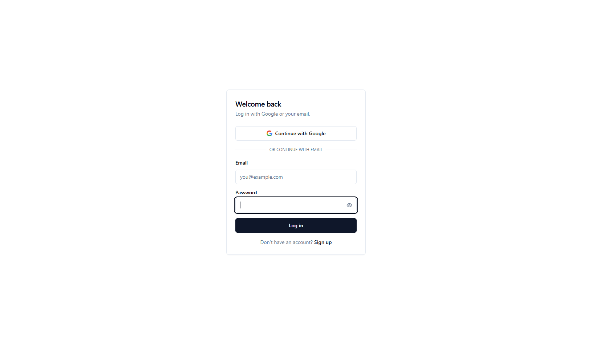
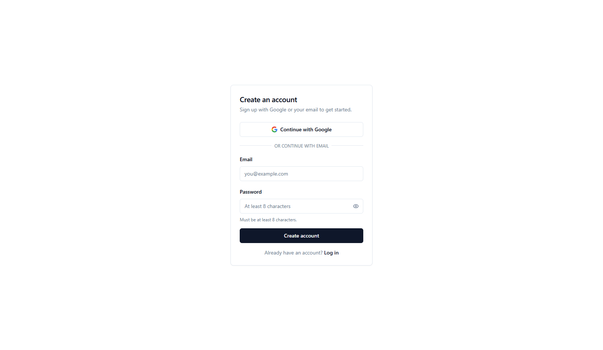

<div align="center">

# AuthForm

**A reusable signup/login module for Next.js — email/password + Google OAuth, powered by Supabase Auth and styled with shadcn/ui.**

[](https://nextjs.org/)
[](https://www.typescriptlang.org/)
[](https://supabase.com/)
[](https://tailwindcss.com/)
[](https://ui.shadcn.com/)
[](https://opensource.org/licenses/MIT)

[](https://github.com/justworkIT/authForm/stargazers)
[](https://github.com/justworkIT/authForm/issues)
[](https://github.com/justworkIT/authForm/commits/main)

</div>

---

## Overview

AuthForm is a drop-in authentication module built for reuse across future SaaS
projects. It ships with working signup, login, and Google OAuth flows on top
of Supabase Auth, styled with shadcn/ui — so a new project gets a secure,
accessible auth screen without re-solving the same problem from scratch.

## Screenshots

<div align="center">

| Login                                                         | Signup                                                          |
| ------------------------------------------------------------- | --------------------------------------------------------------- |
|  |  |

</div>

## Features

- **Email/password auth** — signup and login with server-side validation, duplicate-email handling, and email confirmation
- **Password reset** — forgot-password request and set-new-password flow, with generic responses that avoid confirming which emails have accounts
- **Google OAuth** — one-click sign-in via Supabase's OAuth provider, full redirect flow handled end-to-end
- **Session management** — middleware-based session refresh so users stay logged in across requests
- **Protected routes** — example `/dashboard` route showing server-side auth checks and redirects
- **Accessible by default** — semantic markup, keyboard-operable password toggle, ARIA live regions for form errors
- **Tested** — unit tests (Vitest) for validation logic, e2e tests (Playwright) for signup/login/reset flows
- **Built for reuse** — no hardcoded project values; drop into a new Next.js + Supabase project by swapping env vars and OAuth credentials

## Tech Stack

| Layer     | Choice                                                                         |
| --------- | ------------------------------------------------------------------------------ |
| Framework | [Next.js 14](https://nextjs.org/) (App Router, Server Actions)                 |
| Auth & DB | [Supabase Auth](https://supabase.com/auth)                                     |
| UI        | [shadcn/ui](https://ui.shadcn.com/) + [Tailwind CSS](https://tailwindcss.com/) |
| Language  | TypeScript                                                                     |

## Project Structure

```
app/
  (auth)/
    login/page.tsx          Login route
    signup/page.tsx         Signup route
    forgot-password/page.tsx Request a password reset link
    actions.ts               Server actions: signUpWithEmail, signInWithEmail,
                              signInWithGoogle, logout, requestPasswordReset,
                              updatePassword
  auth/callback/route.ts     OAuth + email-confirmation + reset-link callback handler
  reset-password/page.tsx    Set a new password (requires active recovery session)
  dashboard/page.tsx         Example protected route
  layout.tsx / page.tsx      Root layout + redirect-based landing page
components/
  auth/                      Form components (signup, login, password field,
                              status messages, Google button, card shell, logout)
  ui/                        shadcn/ui primitives (button, input, label, card, separator)
lib/
  supabase/
    client.ts                Browser Supabase client
    server.ts                Server Component / Server Action client
    middleware.ts             Session refresh logic used by middleware.ts
middleware.ts                 Runs on every request to keep the session cookie fresh
```

## Getting Started

### 1. Clone the repo

```bash
git clone https://github.com/justworkIT/authForm.git
cd authForm
npm install
```

### 2. Create a Supabase project

- [supabase.com/dashboard](https://supabase.com/dashboard) → New project
- Copy the Project URL and anon public key from **Settings → API**

### 3. Enable auth providers

- **Authentication → Providers → Email** — on by default; confirm "Confirm email" matches whether you want email verification before login
- **Authentication → Providers → Google** — toggle on, then follow Supabase's prompt for the Google Client ID/Secret (see step 4)
- **Authentication → URL Configuration** — set **Site URL** to your deployed URL (or `http://localhost:3000` during dev), and add `{your-url}/auth/callback` to **Redirect URLs**

### 4. Set up Google OAuth credentials

- [Google Cloud Console](https://console.cloud.google.com/) → APIs & Services → Credentials → Create OAuth client ID (Web application)
- Authorized redirect URI: the callback URL Supabase's Google provider screen shows you (a `supabase.co` URL, not your app's `/auth/callback`)
- Paste the resulting Client ID/Secret into Supabase's Google provider settings
- This step is tied to each Google Cloud project/domain — it does not carry over between apps

### 5. Configure environment variables

```bash
cp .env.local.example .env.local
```

Fill in `NEXT_PUBLIC_SUPABASE_URL` and `NEXT_PUBLIC_SUPABASE_ANON_KEY` from step 2.

### 6. Run it

```bash
npm run dev
```

Visit `/signup` or `/login`. After auth, users land on `/dashboard` (replace this with your app's real landing page — it's a working example here).

## Reusing This in a New Project

| Copy as-is                                                                               | Needs redoing per project                                                                      |
| ---------------------------------------------------------------------------------------- | ---------------------------------------------------------------------------------------------- |
| All files in `components/`, `lib/`, `middleware.ts`, `app/(auth)/`, `app/auth/callback/` | New Supabase project + credentials                                                             |
| Form validation, error handling, accessibility behavior                                  | Google OAuth consent screen / client ID                                                        |
| Session refresh logic                                                                    | `.env.local` values                                                                            |
| —                                                                                        | Redirect targets in `actions.ts` / `callback/route.ts` if `/dashboard` isn't your landing page |

## Design Decisions

- **Generic error on bad login** ("Invalid email or password") is intentional — it avoids confirming whether an email is registered.
- **Server Actions validate independently of the client.** Client-side `required`/`minLength` attributes are UX only; `actions.ts` re-validates everything, since client checks can be bypassed.
- **`middleware.ts` matcher excludes static assets** so it runs only on real navigations, not every image/font request.

## Testing

**Unit tests** (Vitest) cover the pure validation logic in `lib/validation.ts`:

```bash
npm test
```

**E2E tests** (Playwright) cover signup, login, password reset, protected-route redirects, and the password visibility toggle, run against a real dev server and real Supabase project:

```bash
npm run test:e2e
```

> ⚠️ Run e2e tests against a **dev/test Supabase project only** — the signup tests create real (throwaway) user accounts. Flows requiring email inbox access (confirming a signup, clicking a reset link) aren't covered by this starter suite; wiring up an email-testing service (e.g. Mailosaur, Ethereal) is a good next step if you need full coverage.

## Deployment

Deployed easily on [Vercel](https://vercel.com/) — import the repo, add the two Supabase env vars, and deploy. See [Vercel deployment docs](https://vercel.com/docs) for details.

### Keeping Supabase awake (free tier)

Supabase free-tier projects pause after 7 days without database activity. This repo includes a GitHub Action (`.github/workflows/supabase-keepalive.yml`) that pings the database twice a week to prevent that. To enable it:

1. Run the migration in `supabase/migrations/0001_keepalive.sql` against your Supabase project (paste it into the SQL Editor in the Supabase dashboard, or apply via the Supabase CLI)
2. In your GitHub repo, go to **Settings → Secrets and variables → Actions** and add:
   - `SUPABASE_URL` — your project URL
   - `SUPABASE_SERVICE_ROLE_KEY` — from **Settings → API** in Supabase (this key bypasses RLS, so it's only ever used server-side in the Action, never in the app itself)
3. The workflow runs automatically on its schedule, or trigger it manually from the **Actions** tab (`Supabase Keep-Alive` → **Run workflow**) to test it immediately

## Troubleshooting

Real issues hit while building and deploying this project, kept here so they don't get hit twice.

### `MIDDLEWARE_INVOCATION_FAILED` on Vercel

**Cause:** `NEXT_PUBLIC_SUPABASE_URL` / `NEXT_PUBLIC_SUPABASE_ANON_KEY` weren't set in Vercel's project settings — `.env.local` only exists on your machine and is never read by Vercel.

**Fix:** Add both vars in Vercel → **Settings → Environment Variables** (all three environments: Production, Preview, Development), then **redeploy** — Vercel does not retroactively apply new env vars to existing deployments; you must trigger a new one.

### Reset link lands on `/login` with `#error=access_denied&error_code=otp_expired`

**Cause:** The `redirectTo` URL used in `resetPasswordForEmail` (`/auth/callback?next=/reset-password`) wasn't in Supabase's allow-listed Redirect URLs, so Supabase silently fell back to the Site URL and appended the error as a hash fragment.

**Fix:** Supabase dashboard → **Authentication → URL Configuration → Redirect URLs**, add a wildcard: `https://your-domain.com/**`. This covers `/auth/callback` and any future paths, so you won't need to update it again per route.

**Secondary cause to rule out:** email security scanners in some corporate/email-client environments "prefetch" links inside emails, consuming the single-use reset token before the real user clicks it. If the allow-list is correct and this still happens, test with a personal (non-corporate) email address.

### Reset email never arrives, no error shown

**Cause:** Supabase's built-in email service caps out at **2 emails/hour, project-wide** (not per-user) — it's dev/testing-only, not for production. Confirmed by checking Supabase → **Logs → Auth Logs** for repeated `429` responses on `POST /auth/v1/recover`.

**Fix:** Set up custom SMTP (see below). There is no way to raise this limit on the default service.

### Setting up custom SMTP (Brevo)

1. Verify a sender domain in Brevo (**Settings → Senders, Domains & Dedicated IPs → Domains → Add a domain**) — requires DNS access, so it must be a domain you actually own (a `vercel.app` subdomain won't work, since you don't control its DNS)
2. Add the TXT/DKIM records Brevo gives you at your DNS provider; wait for propagation (minutes to ~24h)
3. Generate an **SMTP key** at **Settings → Senders, Domains & Dedicated IPs → SMTP & API → SMTP tab** — ⚠️ this is a different credential from the API key on the adjacent **API Keys** tab; using the API key as the SMTP password will fail auth
4. In Supabase → **Authentication → Emails → SMTP Settings**, enter host `smtp-relay.brevo.com`, port `587`, the SMTP login (looks like `xxxxx@smtp-brevo.com`, shown on the same SMTP tab), and the SMTP key as the password
5. ⚠️ Supabase's host field doesn't trim whitespace — a stray leading/trailing space pasted into the host field produces a "no such host" error in Auth Logs that has nothing to do with your actual credentials

## Contributing

Contributions are welcome — see [CONTRIBUTING.md](./CONTRIBUTING.md) for branch naming, commit conventions, and the PR checklist.

## License

Distributed under the MIT License. See `LICENSE` for details.

## Author

Built by [@justworkIT](https://github.com/justworkIT)
